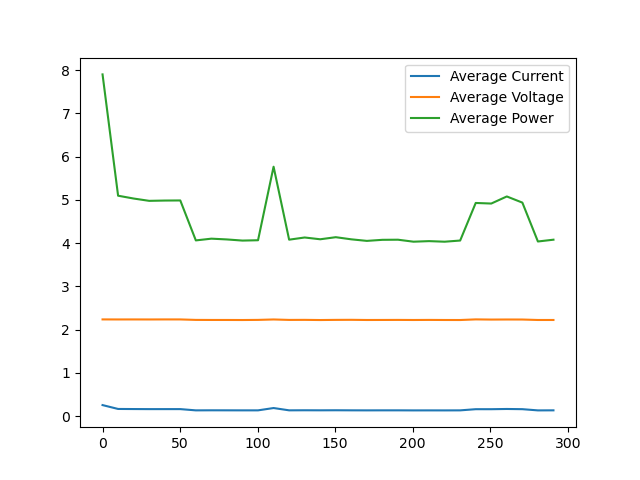
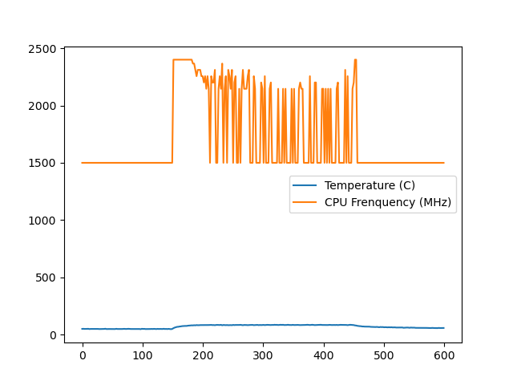

# rpi-5-device-under-testing-tools

Creates a set of tools which evaluate functional, electrical, and firmware components of the raspberry pi 5. These tools aim to flag raspberry pi 5 firmware and hardware that is potentially fraudulent.

## Motivation

Counterfeit or tampered electronic components can enter the supply chain at multiple stages. Traditional inspection methods (e.g., X-ray, visual inspection) are insufficient to detect all forms of counterfeit or malicious modifications.
These tools develops the functional and behavioral testing framework that can identify suspicious or non-authentic raspberry pi 5s using measurable electrical and firmware-based characteristics.

## Setup

To run these tools you will need
- Raspberry Pi 5
- [Waveshare USB UART Debugger](https://www.amazon.com/Waveshare-Raspberry-Connector-Transmission-Connection/dp/B0CTDPG7LB)
- python3 installed

Before running any of the tests, make sure
- the RPi is not turned on until the script is being executed (with the exception of the internals/stress test scripts which are run directly on the RPi 5)
- the UART debugger is plugged into your USB on your machine like so:


To ensure this will work on your python installation, please run the following within this directory:
```
python3 -m venv py_env
source py_env/bin/activate
pip3 install pyserial
pip3 install requests
```
Afterwards, please run the command for your desired script below.

For running `rpi_uart_info_dump.py` if the UART device connected run 
```
python3 python/rpi_uart_info_dump.py <device>
```

`<device>` should be the device associated with the UART debugger. For example on Mac the device appears as `/dev/tty.usbmodem5A980573331`.

For running all of the tests at once and the UART debugger is connected, run
```
python3 python/rpi_test_suite.py <device> <ssh_host>
```

`<ssh_host>` would be something like `rpi-test@192.168.1.68` which locates the Raspberry Pi on the local network.

If running `rpi_internals_check.py`, ssh onto the Raspberry Pi 5 and perform
```
sudo python3 rpi_internals_check.py
```

If running `rpi_stress_test.py`, ssh onto the Raspberry Pi 5 and perform
```
sudo python3 rpi_stress_test.py
```

## Results

You should see bootloader output that looks like this:
```
Received: 0.90 RPi: BOOTSYS release VERSION:69471177 DATE: 2025/05/08 TIME: 15:13:17
rpi_version: 69471177
rpi_date:  2025/05/08
Received: 0.91 BOOTMODE: 0x06 partition 0 build-ts BUILD_TIMESTAMP=1746713597 serial d137e638 boardrev d04170 stc 910729
Received: 0.92 AON_RESET: 00000003 PM_RSTS 00001000
Received: 0.92 POWER_OFF_ON_HALT: 0 WAIT_FOR_POWER_BUTTON 0 power-on-reset 1
Received: 0.93 RP1_BOOT chip ID: 0x20001927
rpi_chip_id: 0x20001927
Received: 0.93 PCIEx1: PWR 0 DET_WAKE 0
Received: 0.93 part 00000000 reset_info 00000000
Received: 0.94 PMIC reset-event 00000000 rtc 00000000 alarm 00000000 enabled 0
Received: 0.94 uSD voltage 3.3V
Received: 1.06 Initialising SDRAM rank 2 total-size: 64 Gbit 4267 (0x14 0x00)
SRAM: 1.06 Initialising SDRAM rank 2 total-size: 64 Gbit 4267 (0x14 0x00)
Received: 1.07 DDR 4267 1 0 64 152 BL:1
ddr_data: 1.07 DDR 4267 1 0 64 152 BL:1
Successfully obtained bootloader information from UART
Comparing received firmware information to known firmware versions...
Firmware information matches known versions, dates, and chip IDs.
Received: 5.03 OCR c0ff8000 [184]
Received: CID: 000353445343313647804c5f00c6011a
Received: CSD: 400e00325b59000076b27f800a404000
Received: 5.04 SD: bus-width: 4 spec: 2 SCR: 0x02358443 0x00000000
Received: 5.05 SD HOST: 200000000 CTL0: 0x00800f04 BUS: 50000000 Hz actual: 50000000 HZ div: 4 (2) status: 0x1fff0000 delay: 2
Received: 5.06 MBR: 0x00004000, 1048576 type: 0x0c
Received: 5.06 MBR: 0x00104000,11632640 type: 0x83
Received: 5.07 MBR: 0x00000000,       0 type: 0x00
Received: 5.07 MBR: 0x00000000,       0 type: 0x00
Received: 5.78 Trying partition: 0
Received: 5.84 type: 32 lba: 16384 'mkfs.fat' ' bootfs     ' clusters 1032412 (1)
Received: 5.08 rsc 32 fat-sectors 8066 root dir cluster 2 sectors 0 entries 0
Received: 5.09 FAT32 clusters 1032412
Received: 5.10 [sdcard] autoboot.txt not found
Received: 5.10 Select partition rsts 0 C(boot_partition) 0 EEPROM config 0 result 1
Received: 5.12 Trying partition: 1
Received: 5.18 type: 32 lba: 16384 'mkfs.fat' ' bootfs     ' clusters 1032408 (1)
Received: 5.12 rsc 32 fat-sectors 8066 root dir cluster 2 sectors 0 entries 0
Received: 5.13 FAT32 clusters 1032408
Received: 5.37 Read config.txt bytes     1247 hnd 0x91d
Received: 5.14 [sdcard] pieeprom.upd not found
Received: 5.43 usb_max_current_enable default 0 max-current 900
Received: 5.59 Read bcm2712-rpi-5-b.dtb bytes    78744 hnd 0x476
Received: 5.16 dt-match: compatible: raspberrypi,5-model-b match: brcm,bcm2712
Received: 5.16 dt-match: compatible: brcm,bcm2712 match: brcm,bcm2712
Received: 5.78 Selecting USB low current limit
Received: 5.18 MESS:00:00:05.180932:0: *** Restart logging
Received: 5.91 Read /config.txt bytes     1247 hnd 0x91d
Received: 5.98 Read /config.txt bytes     1247 hnd 0x91d
Received: 5.20 MESS:00:00:05.203522:0: Initial voltage 800000 temp 27937
Received: 5.40 MESS:00:00:05.404125:0: avs_2712: AVS pred 8911 891100 temp 26838
Received: 5.40 MESS:00:00:05.407727:0: vpred 891 mV +0
Received: 6.03 MESS:00:00:06.036013:0: FB framebuffer_swap 1
Received: 6.05 MESS:00:00:06.055766:0: Select resolution HDMI0/2 hotplug 0 max_mode 2
Received: 6.05 MESS:00:00:06.059821:0: Select resolution HDMI1/2 hotplug 0 max_mode 2
Received: 6.07 Loading 'initramfs_2712' to 0x00000000 offset 0x0
No data received, waiting 3 seconds...
Received: 7.10 Read initramfs_2712 bytes 22523888 hnd 0x23314
Received: 7.22 MESS:00:00:07.222527:0: initramfs (initramfs_2712) loaded to 0x2da85000 (size 0x157aff0)
Received: 7.23 MESS:00:00:07.232905:0: dtb_file 'bcm2712-rpi-5-b.dtb'
Received: 7.23 Loading 'bcm2712-rpi-5-b.dtb' to 0x00000000 offset 0x100
Received: 7.52 Read bcm2712-rpi-5-b.dtb bytes    78744 hnd 0x476
Received: 7.99 Read /overlays/overlay_map.dtb bytes     5971 hnd 0x22ff5
Received: 7.33 PCIEx1: PWR 0 DET_WAKE 0
Received: 7.50 Read /config.txt bytes     1247 hnd 0x91d
Received: 7.35 MESS:00:00:07.352271:0: dtparam: audio=on
Received: 7.36 MESS:00:00:07.360824:0: Unknown dtparam 'audio' - ignored
Received: 7.88 Read /overlays/vc4-kms-v3d-pi5.dtbo bytes     3306 hnd 0x232c7
Received: 7.43 MESS:00:00:07.435117:0: Loaded overlay 'vc4-kms-v3d-pi5'
Received: 7.08 Read /cmdline.txt bytes      221 hnd 0x23313
Received: 7.61 MESS:00:00:07.610198:0: Read command line from file 'cmdline.txt':
Received: 7.61 MESS:00:00:07.616696:0: 'console=serial0,115200 console=tty1 root=PARTUUID=45110d0a-02 rootfstype=ext4 fsck.repair=yes rootwait resize quiet splash plymouth.ignore-serial-consoles cfg80211.ieee80211_regdom=US ds=nocloud;i=rpi-imager-1778375625752'
Received: 7.81 MESS:00:00:07.816549:0: RPM 0, max RPM 0
Received: 7.85 BMD "armstub8-2712.bin" not found
Received: 7.60 fs_open: 'armstub8-2712.bin'
Received: 7.86 Loading 'kernel_2712.img' to 0x00000000 offset 0x200000
Received: 8.24 Read kernel_2712.img bytes  9698043 hnd 0x1334e
Received: 9.61 MESS:00:00:09.610521:0: Device tree loaded to 0x2da71600 (size 0x1398d)
Received: 9.61 PCI1 reset
Received: 9.62 PCI2 reset
Received: 9.63 set_reboot_order 0
Received: 9.63 set_reboot_arg1 0
Received: 9.63 USB-OTG disconnect
Received: 9.67 MESS:00:00:09.679827:0: Starting OS 9679 ms
Received: 9.68 MESS:00:00:09.685352:0: 00000040: -> 00000480
Received: 9.68 MESS:00:00:09.687201:0: 00000030: -> 00100080
Received: 9.69 MESS:00:00:09.691914:0: 00000034: -> 00100080
Received: 9.69 MESS:00:00:09.696627:0: 00000038: -> 00100080
Received: 9.70 MESS:00:00:09.701340:0: 0000003c: -> 00100080
No data received, waiting 3 seconds...
Received: NOTICE:  BL31: v2.6(release):v2.6-240-gfc45bc492
Received: NOTICE:  BL31: Built : 12:55:13, Dec  4 2024
No data received, waiting 3 seconds...
No data received, waiting 3 seconds...
No data received, waiting 3 seconds...
No data received, waiting 3 seconds...
No data received, waiting 3 seconds...
Received: 
Received: Debian GNU/Linux 13 andrew-rpi-test ttyAMA10
No data received, waiting 3 seconds...
^[[57;11R^[[57;197R^[[57;197R^[[57;197RReceived: My IP address is 192.168.1.68 fe80::da3a:ddff:fed2:c46
No data received, waiting 3 seconds...
Received: andrew-rpi-test login:                                                                                                                                                                    [   24.244942] reboot: Restarting system
Successfully reached login prompt
```

You should also see internals output that looks like the following:
```
CPU Information:
processor	: 0
BogoMIPS	: 108.00
Features	: fp asimd evtstrm aes pmull sha1 sha2 crc32 atomics fphp asimdhp cpuid asimdrdm lrcpc dcpop asimddp
CPU implementer	: 0x41
CPU architecture: 8
CPU variant	: 0x4
CPU part	: 0xd0b
CPU revision	: 1

processor	: 1
BogoMIPS	: 108.00
Features	: fp asimd evtstrm aes pmull sha1 sha2 crc32 atomics fphp asimdhp cpuid asimdrdm lrcpc dcpop asimddp
CPU implementer	: 0x41
CPU architecture: 8
CPU variant	: 0x4
CPU part	: 0xd0b
CPU revision	: 1

processor	: 2
BogoMIPS	: 108.00
Features	: fp asimd evtstrm aes pmull sha1 sha2 crc32 atomics fphp asimdhp cpuid asimdrdm lrcpc dcpop asimddp
CPU implementer	: 0x41
CPU architecture: 8
CPU variant	: 0x4
CPU part	: 0xd0b
CPU revision	: 1

processor	: 3
BogoMIPS	: 108.00
Features	: fp asimd evtstrm aes pmull sha1 sha2 crc32 atomics fphp asimdhp cpuid asimdrdm lrcpc dcpop asimddp
CPU implementer	: 0x41
CPU architecture: 8
CPU variant	: 0x4
CPU part	: 0xd0b
CPU revision	: 1

Revision	: d04170
Serial		: 9d00ce41d137e638
Model		: Raspberry Pi 5 Model B Rev 1.0

Memory Information:
MemTotal:        8252368 kB
MemFree:         3798880 kB
MemAvailable:    6126208 kB
Buffers:          116704 kB
Cached:          2427504 kB
SwapCached:            0 kB
Active:          2358976 kB
Inactive:        1626160 kB
Active(anon):    1693488 kB
Inactive(anon):        0 kB
Active(file):     665488 kB
Inactive(file):  1626160 kB
Unevictable:      115808 kB
Mlocked:              16 kB
SwapTotal:       2097136 kB
SwapFree:        2097136 kB
Zswap:                 0 kB
Zswapped:              0 kB
Dirty:                 0 kB
Writeback:             0 kB
AnonPages:       1556832 kB
Mapped:           472688 kB
Shmem:            253216 kB
KReclaimable:     125616 kB
Slab:             193712 kB
SReclaimable:     125616 kB
SUnreclaim:        68096 kB
KernelStack:        9232 kB
PageTables:        24576 kB
SecPageTables:       176 kB
NFS_Unstable:          0 kB
Bounce:                0 kB
WritebackTmp:          0 kB
CommitLimit:     6223312 kB
Committed_AS:    8564160 kB
VmallocTotal:   68447887360 kB
VmallocUsed:       59280 kB
VmallocChunk:          0 kB
Percpu:             1344 kB
CmaTotal:          65536 kB
CmaFree:           55296 kB

Checking I/O behavior...
GPIO pins set up successfully.
```

After this, you should look for graphs for power consumption and temperature testing the look like this, respectively:

