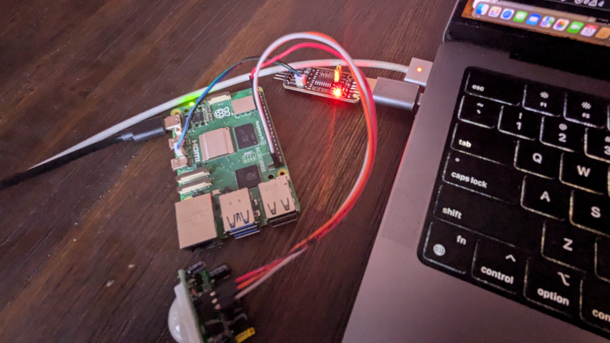

# rpi-5-device-under-testing-tools

Creates a set of tools which evaluate functional, electrical, and firmware components of the raspberry pi 5. These tools aim to flag raspberry pi 5 firmware and hardware that is potentially fraudulent.

## Motivation

Counterfeit or tampered electronic components can enter the supply chain at multiple stages. Traditional inspection methods (e.g., X-ray, visual inspection) are insufficient to detect all forms of counterfeit or malicious modifications.
These tools develops the functional and behavioral testing framework that can identify suspicious or non-authentic raspberry pi 5s using measurable electrical and firmware-based characteristics.

## Setup

To run these tools you will need
- Raspberry Pi 5
- [Waveshare USB UART Debugger](https://www.amazon.com/Waveshare-Raspberry-Connector-Transmission-Connection/dp/B0CTDPG7LB)
- python3 installed

Before running any of the tests, make sure
- the RPi is not turned on until the scip
- the UART debugger is plugged into your USB on your machine like so:


For running `rpi_uart_info_dump.py` if the UART device connected run 
```
python3 python/rpi_uart_info_dump.py <device>
```

`<device>` should be the device associated with the UART debugger. For example on Mac the device appears as `/dev/tty.usbmodem5A980573331`.

For running all of the tests at once and the UART debugger is connected, run
```
python3 python/rpi_test_suite.py <device> <ssh_host>
```

`<ssh_host>` would be something like `rpi-test@192.168.1.68` which locates the Raspberry Pi on the local network.

If running `rpi_internals_check.py`, ssh onto the Raspberry Pi 5 and perform
```
sudo python3 rpi_internals_check.py
```

If running `rpi_stress_test.py`, ssh onto the Raspberry Pi 5 and perform
```
sudo python3 rpi_stress_test.py
```

## Results

TODO